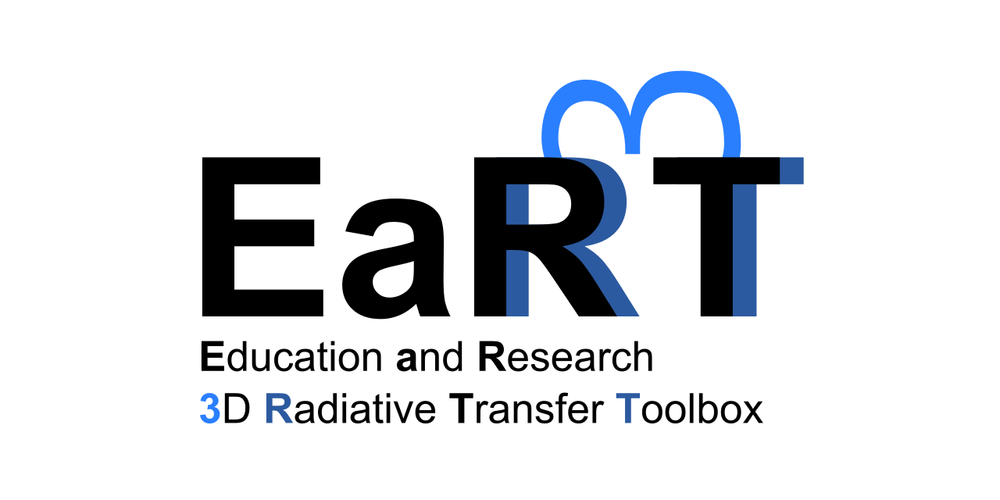

=====
EaR³T
=====

.. warning::

    This documentation is under active development.

The Education and Research 3D Radiative Transfer Toolbox (EaR³T, /ɜːt/) is a Python software package
developed for cutting-edge radiative transfer and remote sensing applications. It provides high-level
interfaces to automate the process of performing IPA/3D radiative transfer calculations for measured
or modeled cloud/aerosol fields using publicly available IPA/3D radiative transfer models
including MCARaTS, libRadtran (IPA only), and SHDOM (under development).

EaR³T is publicly available at https://github.com/hong-chen/er3t and licensed under `GPLv3 <https://www.gnu.org/licenses/gpl-3.0.html>`_.

Applications
------------

* Spaceborne and airborne remote sensing;

* 3D radiative effects (of clouds, aerosols, and trace gases etc.);

* Synthetic data generation (for CNN training);

* Novel retrieval algorithm development (e.g., CNN-based).

Authors and Contributors
------------------------

EaR³T was originally designed and developed by `Hong Chen <hong.chen@lasp.colorado.edu>`_ and
`Sebastian Schmidt <sebastian.schmidt@lasp.colorado.edu>`_ at the University of Colorado Boulder
in 2019. `Hong Chen`_ is the current maintainer.

Additionally, EaR³T has been actively contributed by the following developers:

* `Vikas Nataraja <Vikas.HanasogeNataraja@lasp.colorado.edu>`_ (Dec., 2022 - current)

* `Ken Hirata <Ken.Hirata@colorado.edu>`_ (Jan., 2023 - current)

* `Yu-Wen Chen <Yu-Wen.Chen@colorado.edu>`_ (Apr., 2023 - current)

Community Support
-----------------

We believe only we together can we do better and go futher. Thus we created a Discord server with aspiration
to foster an informal radiative transfer and remote sensing focused community and to facilitate discussions
and collaborations. Please `join us on Discord <https://discord.gg/ntqsguwaWv>`_ to hang out together.

How to Cite
-----------

If you find EaR³T is helpful and would like to cite it, here are the references:

* `Publication <https://doi.org/10.5194/amt-16-1971-2023>`_

   Chen, H., Schmidt, K. S., Massie, S. T., Nataraja, V., Norgren, M. S., Gristey, J. J., Feingold, G.,
   Holz, R. E., and Iwabuchi, H.: The Education and Research 3D Radiative Transfer Toolbox (EaR³T) -
   Towards the Mitigation of 3D Bias in Airborne and Spaceborne Passive Imagery Cloud Retrievals,
   Atmos. Meas. Tech., 16, 1971–2000, doi:10.5194/amt-16-1971-2023, 2023.

* `Software <https://github.com/hong-chen/er3t>`_

   Chen, H., Schmidt, K. S., Nataraja, V., Hirata, K., and Chen, Y-W: hong-chen/er3t: er3t-v0.1.1 (v0.1.1),
   Zenodo [code], https://doi.org/10.5281/zenodo.7734965, 2023. 

|
|

.. toctree::
   :maxdepth: 1
   :caption: Contents:

   Home <self>
   Installation <source/tutorial/install>
   Usage <source/tutorial/usage>
   EaR³T Tools <source/tutorial/tool>
   EaR³T API <source/api/index>
   Contribution <source/tutorial/contribute>
   Speed Contest <source/other/contest>
   Gallery <source/other/gallery>
   Highlights <source/other/highlight>
   Acknowledgements <source/other/acknowledge>
   FAQ <source/other/faq>
